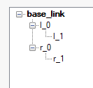
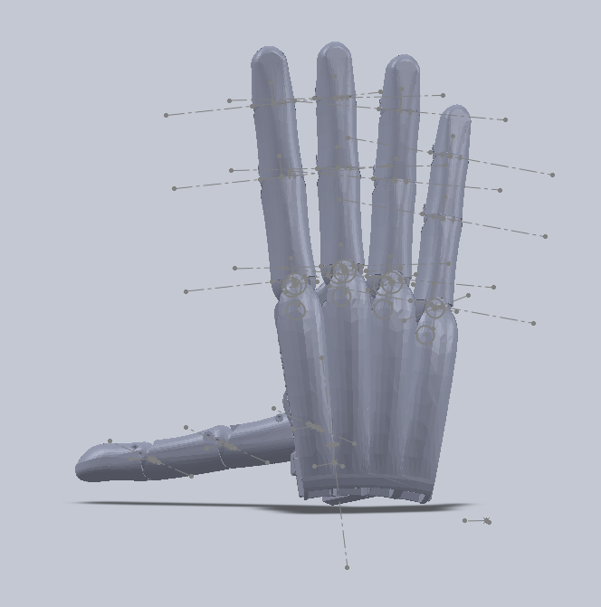
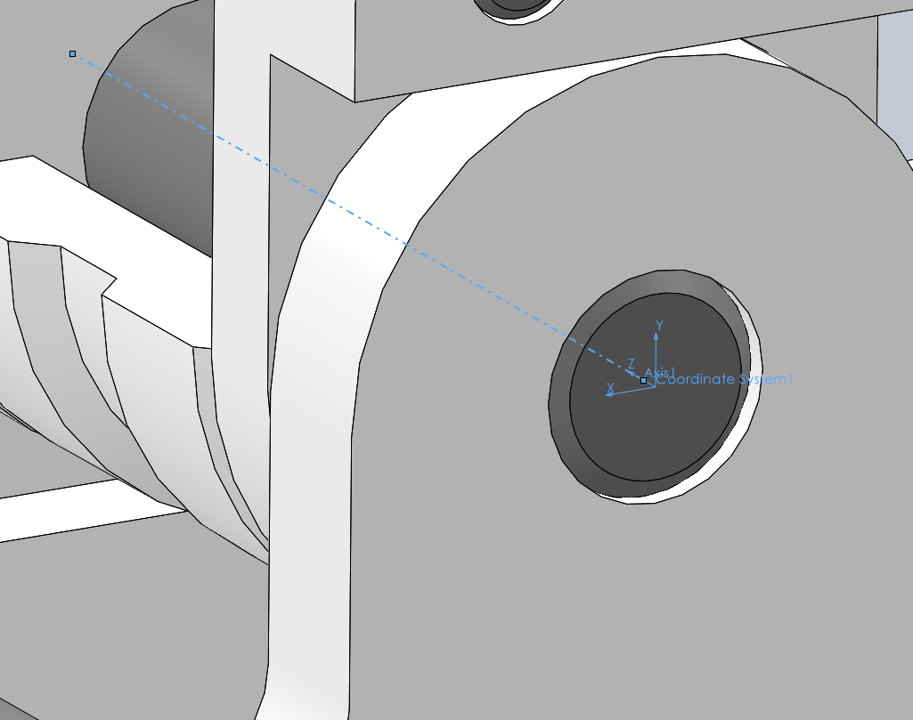
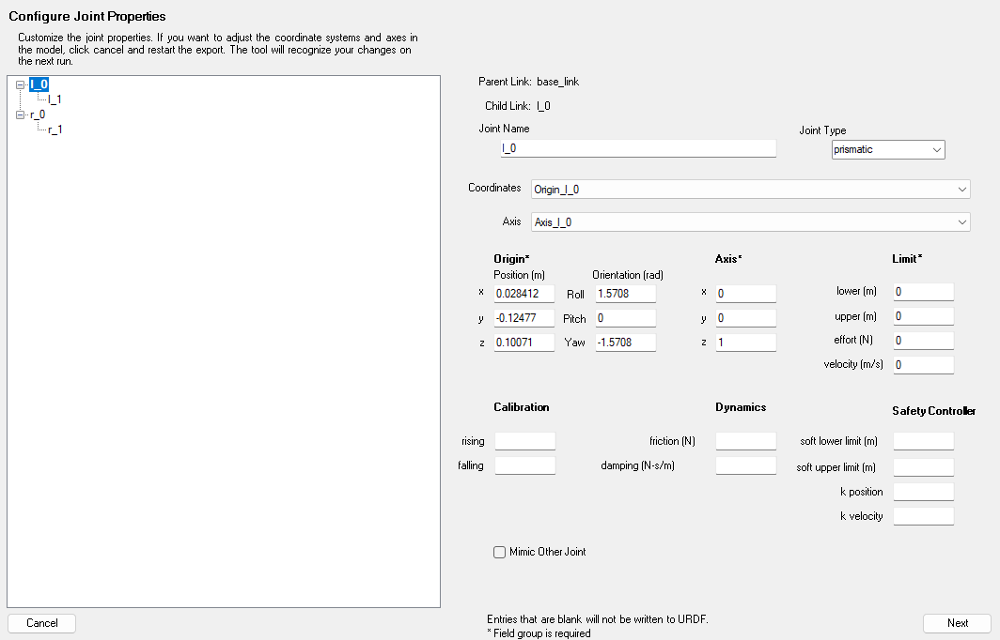
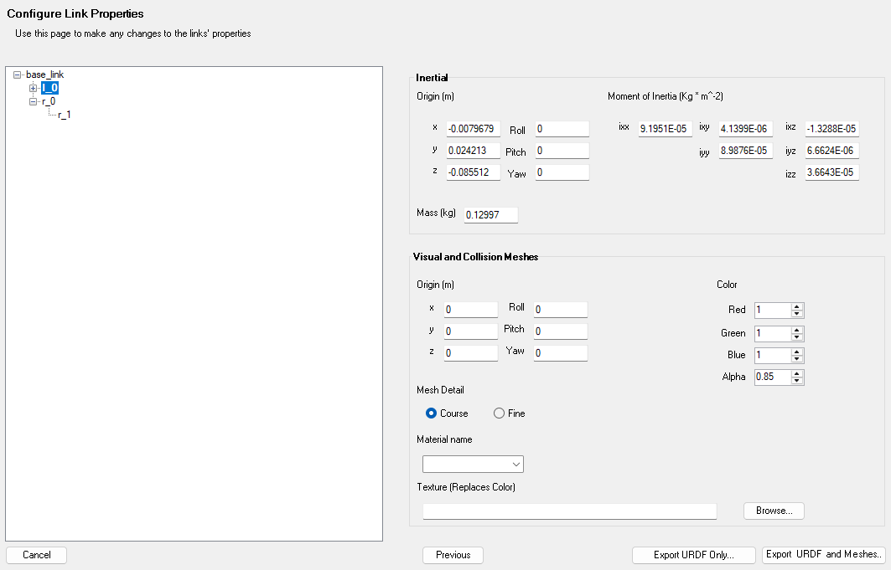
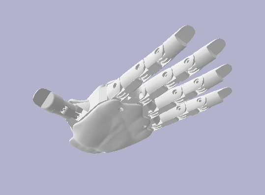
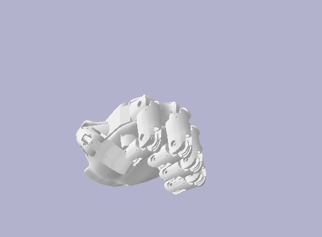
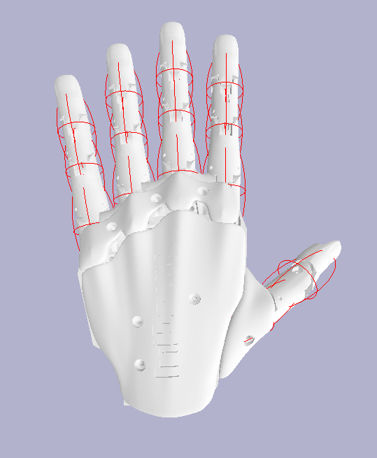

# Guide on generating URDFs

## Method 1 - SOLIDWORKS to URDF plugin

Using the SOLIDWORKS to URDF plugin, it is possible to convert a SOLIDWORKS assembly into a URDF. This method takes the material data assigned to each individual part and uses it to generate the relevant URDF physical properties, such as mass, centre of mass and inertia.

First, create or open a SOLIDWORKS assembly. Fully mate the joints, then align them in a resting pose where each joint would be recognised as being at its zero position.

Open the SOLIDWORKS to URDF plugin and manually assign the number of links and their respective joints.

The plugin is capable of automatically detecting the location and orientation of joints by inferring them from the mates within the assembly. However, this method can be unreliable depending on the assembly. It is possible to gauge the success based on the axes and origins added by the plugin.

In the event that this method doesn't work, axes and origins have to be added manually to each joint. At each point of rotation, create an origin and an axis going through the joint.

Once this is done, each joint will have to have its respective origin and axis labelled, as well as which coordinate axis is collinear with the joint axis. This can then be assigned in one of the windows during the URDF exporting process.

After this, exporting the URDF should include all the relevant material and physical data obtained from the SOLIDWORKS assembly, such as mass, centre of mass and inertia. In the examples in this repository, the main material of the links is assumed to be a 3D printed material, while other parts such as bearings and motors retain their original material data.

### Known issues

Depending on the origin of some mesh/part files, older versions of SOLIDWORKS may have issues saving or converting these to STL or similar mesh file formats. This is usually due to the meshes being made in different CAD programs, which can cause compatibility issues during conversion.

## Method 2 - MJCF configuration to URDF converter

The first method requires a SOLIDWORKS assembly in order to work. However, many robotic manipulators do not have their original CAD models available as SOLIDWORKS assemblies. Another widely used robot definition format is MJCF (MuJoCo XML), used by the MuJoCo simulator. MJCF can contain much of the information required to construct a URDF, allowing a detailed URDF to be generated from an existing MJCF definition without requiring the original SOLIDWORKS assembly.

The converter takes the information contained within the MJCF definition and converts it into the equivalent URDF properties. Bodies within the MJCF are converted into links, with their respective joints retaining their position, orientation, axis and joint limits. Bodies that are only used for positioning are ignored, with their position and orientation instead being applied to their respective child links.

The meshes defined within the MJCF are used for both the visual and collision meshes within the URDF. Rather than directly copying the inertial properties from the MJCF, a specific material density is assigned and used with the mesh geometry to recalculate the mass, centre of mass and inertia of each link. This allows the physical properties to be generated consistently with the material assumptions used in Method 1. In the event that multiple meshes are used for a single link, their physical properties are combined.

Joint equality constraints within the MJCF are converted into mimic joints, retaining their original multiplier and offset. Once converted, all of the links and joints are connected into a single URDF hierarchy.

## Verification

To verify that the export process has finished with no obvious issues, two visual checks are performed using the PyBullet simulator.

The first check tests for correct joint motion. When using the SOLIDWORKS to URDF exporter, especially when using the automatic joint detection, there is a chance that the joint axes are in the wrong location or direction. This is visible when links move in unnatural ways, making it clear that a joint axis is misaligned or incorrect.

The second check verifies that the inertia data is generally correct by drawing inertia ellipsoids obtained from the URDF inertia data. The ellipsoids should be reasonably positioned and oriented relative to the physical links of the model. If there are ellipsoids floating in space or massively skewed when compared to the model, then something has likely gone wrong during the exporting process.

